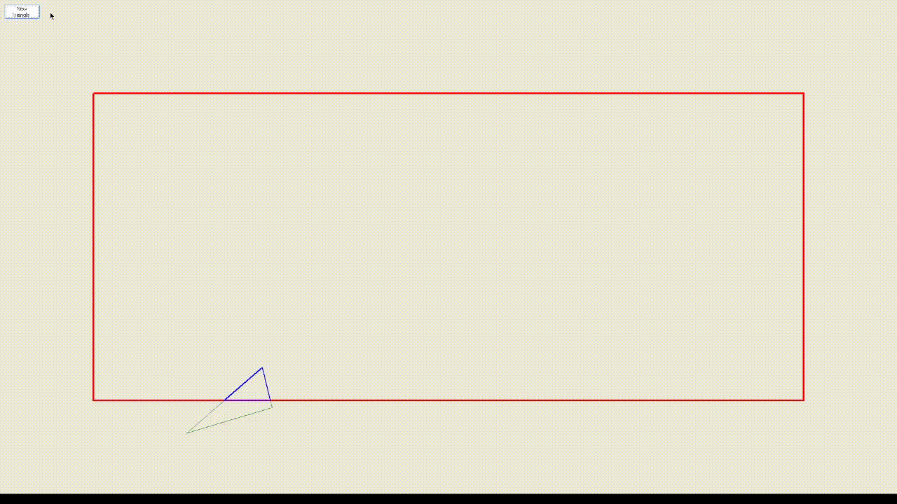

# Visual\_Sutherland-Hodgman
This is a C# implementation of the Sutherland-Hodgman ([wikipedia](https://en.wikipedia.org/wiki/Sutherland%E2%80%93Hodgman_algorithm))
polygon clipping algorithmn.

As is, it operates on randomly generated triangles.

